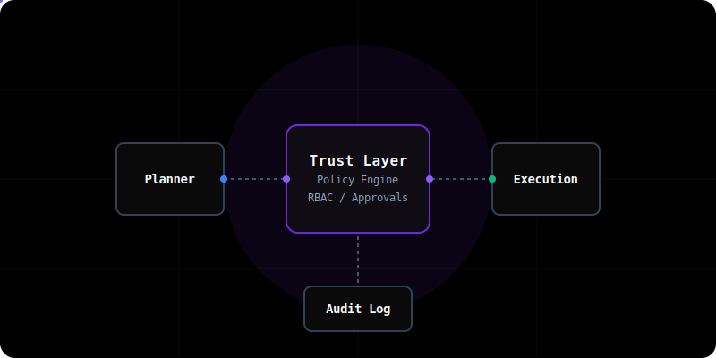

<div align="center">

# GovernOS

**The Trust Layer for Autonomous Agents**

[](https://opensource.org/licenses/MIT)
[](https://github.com/organization/governos/actions)
[](https://www.python.org/)
[](https://nodejs.org/)
[](https://react.dev/)
[](https://docs.docker.com/compose/)

GovernOS orchestrates complex, cross-service workflows generated by LLMs while enforcing strict security, compliance, and cost boundaries. It turns natural-language goals into deterministic, machine-queryable execution plans that require human approval for risky actions.

**[Documentation](https://docs.governos.io)** · **[API Reference](https://docs.governos.io/api/reference)** · **[Demo](https://DARREN-2000.github.io/GovernOS/)**

---

[](https://render.com/deploy)

</div>

<br />

<div align="center">
  
</div>

<br />

## ☁️ Enterprise-Grade Agent Orchestration

Most agent frameworks (like LangChain or AutoGen) assume the LLM directly calls tools. GovernOS is designed for production scenarios where the "tool" is a destructive API call (e.g., dropping a table, sending a wire transfer) that requires auditing, authorization, and a deterministic trust layer.

GovernOS solves this by introducing a **deterministic trust layer** between the LLM planner and the execution environment.

### 🌟 Core Capabilities

* **Preview Before Execute:** LLM intents are compiled into typed Execution Plans. You always see exactly what will happen before it does.
* **Deterministic Policy Enforcement:** Built-in rules block risky plans (e.g., spending over $100, deleting production databases).
* **Human-in-the-Loop (HITL):** Asynchronous approval workflows for actions flagged by the policy engine.
* **Idempotent Execution:** Built-in support for retries, state recovery, and automatic rollbacks via the `compensate()` contract.
* **Contextual Memory Isolation:** Scoped context (Personal, Project, Organization) prevents data leakage between multi-tenant environments.
* **Premium UX Dashboard:** A beautiful, developer-first React interface for tracking workflow state and approving actions.

<br />

## 📷 Experience

<div align="center">
  
  
</div>

<br />

## 🏛️ Architecture Overview

GovernOS separates planning from execution, connected by an approval state machine. The system is composed of a Python orchestration core, a Node.js API, and a React frontend.

```mermaid
graph TD
    %% Styling
    classDef user fill:#2563eb,stroke:#1d4ed8,stroke-width:2px,color:#fff;
    classDef agent fill:#059669,stroke:#047857,stroke-width:2px,color:#fff;
    classDef core fill:#7c3aed,stroke:#6d28d9,stroke-width:2px,color:#fff;
    classDef service fill:#ea580c,stroke:#c2410c,stroke-width:2px,color:#fff;
    classDef db fill:#475569,stroke:#334155,stroke-width:2px,color:#fff;

    User([User Intent]):::user --> Planner[LLM Planner Service]:::agent
    Planner --> |Generates| Plan(Workflow Spec)
    Plan --> Executor[GovernOS Python Core Engine]:::core

    subgraph Trust Layer
        Executor --> Policy[Policy Engine]:::core
        Policy --> |Needs Approval| Human([Human Approver]):::user
        Human --> |Approves| ExecutionQueue
        Policy --> |Safe| ExecutionQueue
    end

    ExecutionQueue --> Worker[Node API & Workers]:::service
    Worker --> Plugin[Action Plugins]:::service

    subgraph Plugin Contract
        Plugin --> Preview[preview()]
        Plugin --> Execute[execute()]
        Plugin --> Compensate[compensate()]
    end

    Worker --> Audit[(Audit Service)]:::db
    Worker --> Memory[(Memory Store)]:::db
```

### Component Responsibilities

| Component | Stack | Responsibility |
| :--- | :--- | :--- |
| **Python Core** | Python 3.10+, FastAPI, NetworkX, AST | Builds dependency graphs, compiles machine-queryable context, policy evaluation. |
| **Backend API** | Node.js 20+, Express, SQLite / Temporal | Orchestrates requests, manages database state, exposes endpoints to frontend. |
| **Web Dashboard**| React 19, Vite, Tailwind CSS, shadcn/ui | Developer-first interface for approving workflows and monitoring systems. |

<br />

## 🚀 Quick Start

Get your local environment running in minutes. GovernOS supports fully containerized local execution.

### Prerequisites

* [Docker & Docker Compose](https://docs.docker.com/compose/install/)
* [Python 3.10+](https://www.python.org/downloads/) & [Poetry](https://python-poetry.org/docs/#installation)
* [Node.js 20+](https://nodejs.org/en/download/) & [pnpm](https://pnpm.io/installation) (strictly `pnpm` only)

### Installation

```bash
# 1. Clone the repository
git clone https://github.com/organization/governos.git
cd governos

# 2. Run the full stack via Docker Compose (Recommended)
docker-compose up --build
```
> **Services Started:**
> * **Dashboard:** `http://localhost:80` (or `http://localhost:5173` if run natively)
> * **Node API:** `http://localhost:3001`
> * **Python Engine:** `http://localhost:8000`

### Manual Native Start

For active development, run the services natively:

```bash
# Terminal 1: Python Core
poetry install
poetry run python -m uvicorn governos.api:app --host 0.0.0.0 --port 8000

# Terminal 2: Node API
cd apps/api
pnpm install && pnpm run build
node dist/index.js

# Terminal 3: React Web App
cd apps/web
pnpm install && pnpm run dev
```

### ⚡ Example API Usage

```bash
# 1. Authenticate (returns a JWT token)
export TOKEN=$(curl -s -X POST http://localhost:3001/api/v1/login \
  -H "Content-Type: application/json" \
  -d '{"email":"admin@governos.io","password":"password"}' | jq -r .token)

# 2. Submit a high-level intent
curl -X POST http://localhost:3001/api/v1/intents \
  -H "Content-Type: application/json" \
  -H "Authorization: Bearer $TOKEN" \
  -d '{"description": "Provision a new secure S3 bucket for project Alpha"}'
```

<br />

## 🛡️ Enterprise Security & Validation

GovernOS is built on a foundation of strict security paradigms. Security is not a feature; it's the core premise of the framework.

* **File Parsing Safety:** All memory operations validating files verify `MAX_FILE_SIZE` and `os.path.isfile` before buffering, preventing DoS.
* **Side-Effecting Actions:** All side-effect actions **must** implement `preview()`, `execute()`, and `compensate()` to ensure atomic rollbacks.
* **Auditing:** Every workflow mutation is written to an immutable event ledger.

Please consult our [Threat Model](docs/security/threat-model.md) and [Security Policy](SECURITY.md) before pushing to production.

<br />

## 📊 Performance Engineering

The internal Python Engine utilizes highly optimized data structures to ensure latency is kept to a minimum:

* **Serialization Optimization:** Tight data loops (e.g. `networkx` graph construction) explicitly avoid Pydantic's `model_dump()` in favor of high-performance `__dict__` serialization.
* **AST Parsing:** Python's built-in `ast` module provides loss-tolerant syntax parsing for context building.

<br />

## 🤝 Contributing

We welcome contributions from the community! From core architecture improvements to new connectors, every PR makes GovernOS better.

Read our [Contributing Guidelines](CONTRIBUTING.md) to get started. Before submitting a Pull Request, always ensure tests and type checks pass:

```bash
# Run tests
poetry run pytest tests/

# Run formatting and linting
poetry run ruff check .

# Run static type checking
poetry run mypy .
```

<br />

## 📄 License & Legal

GovernOS is an open-source project licensed under the [MIT License](LICENSE).

<div align="center">
  <i>Built with precision for modern autonomous systems.</i>
</div>
