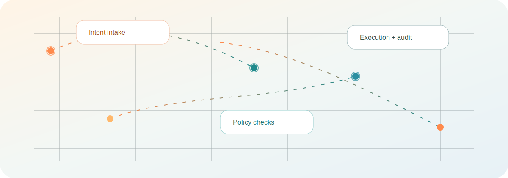
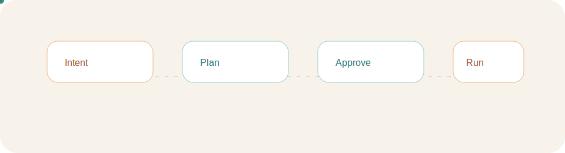

<div align="center">
  
  <h1>IntentGraph</h1>
  <p>IntentGraph is a multi-tenant action OS that turns natural-language goals into trusted workflows.</p>
  <p>
    <a href="https://DARREN-2000.github.io/IntentGraph/">Live demo</a> |
    <a href="https://github.com/DARREN-2000/IntentGraph/blob/main/docs/architecture/overview.md">Architecture</a> |
    <a href="https://github.com/DARREN-2000/IntentGraph/blob/main/docs/runbooks/local-development.md">Runbook</a>
  </p>
</div>

## Motion previews




<video src="docs/videos/intentgraph-dashboard-demo.webm" controls muted loop playsinline width="100%"></video>

## Why IntentGraph

- Preview-first actions with policy gates and human approvals.
- Typed schema validation for every LLM output.
- Audit events for every workflow run and critical transition.
- Multi-tenant memory scopes with strict ownership boundaries.
- Demo-ready UI with live and simulated modes.

## Table of Contents

1. [Product Principles](#product-principles)
2. [Experience](#experience)
3. [Architecture at a Glance](#architecture-at-a-glance)
4. [Monorepo Layout](#monorepo-layout)
5. [Quick Start (Local)](#quick-start-local)
6. [GitHub Pages Demo](#github-pages-demo)
7. [Web Dashboard](#web-dashboard)
8. [Screenshots and Demo Video](#screenshots-and-demo-video)
9. [Build, Test, and Quality Gates](#build-test-and-quality-gates)
10. [Deployment Paths](#deployment-paths)
11. [Documentation Map](#documentation-map)
12. [Troubleshooting](#troubleshooting)
13. [Roadmap to Production-Ready](#roadmap-to-production-ready)

## Product Principles

IntentGraph follows these guarantees in design and implementation:

1. Preview before execute.
2. Human approval for risky actions (delete, spend, provision, or external send).
3. Typed validation of all LLM outputs before action execution.
4. Audit events for all workflow runs and critical step transitions.
5. Policy checks before risky execution.
6. Memory scoped by ownership boundaries (personal, org, project, session).

## Experience

The web experience now includes:

- Editorial hero with live or demo environment badges.
- Intent studio with plan preview, confidence meter, and policy checks.
- Demo playground with curated use cases and activity feed.
- Action catalog filters, integrations gallery, and pricing preview.
- Changelog and roadmap sections for product visibility.

## Architecture at a Glance

```text
User Intent (Web / CLI)
  -> Planner Service (intent -> workflow spec)
  -> Executor Service (policy + approvals + runtime)
  -> Action Plugins (preview/execute/compensate)
  -> Audit Service (event trail + integrity)
  -> Memory Service (scoped context)
```

Core building blocks:

- `packages/workflow-spec`: workflow types and runtime.
- `packages/action-sdk`: ergonomic action/plugin authoring.
- `packages/policy`: policy checks and risk rules.
- `packages/connectors`: side-effect connectors (GitHub, Slack, Gmail, etc.).
- `services/*`: planner, executor, approvals, audit, memory.
- `apps/web`: dashboard for intent planning and approval flow.
- `packages/cli`: command line workflow planning and execution.

## Monorepo Layout

```text
IntentGraph/
  apps/
    api/
    web/
    worker/
    extension/
  packages/
    workflow-spec/
    action-sdk/
    connectors/
    policy/
    prompts/
    shared/
    ui/
    cli/
  services/
    planner/
    executor/
    approvals/
    audit/
    memory/
  docs/
  infra/
```

## Quick Start (Local)

### Prerequisites

- Node.js >= 20
- npm >= 10
- Docker + Docker Compose (recommended for full stack)
- Helm (optional for chart validation)

### 1) Install dependencies

```bash
npm install
```

### 2) Build workspace

```bash
npm run build
```

### 3) Run tests

```bash
npm test
```

### 4) Run local services with Docker

```bash
docker compose up -d
docker compose logs -f api
```

### 5) Run web dashboard

```bash
cd apps/web
npm run dev
```

By default the dashboard is available on `http://localhost:3000`.

### 6) Run demo mode locally

```bash
cd apps/web
NEXT_PUBLIC_DEMO_MODE=true npm run dev
```

### 7) Health checks

```bash
curl http://localhost:3001/healthz
curl http://localhost:3001/readyz
curl http://localhost:3001/api/v1/version
```

## GitHub Pages Demo

The web UI deploys as a static demo to GitHub Pages via the workflow in `.github/workflows/pages.yml`.

- Demo URL: `https://DARREN-2000.github.io/IntentGraph/`
- Demo mode is enabled via `NEXT_PUBLIC_DEMO_MODE=true` and `NEXT_PUBLIC_DEPLOY_ENV=github-pages`.

To export locally:

```bash
cd apps/web
GITHUB_PAGES=true NEXT_PUBLIC_DEMO_MODE=true NEXT_PUBLIC_DEPLOY_ENV=github-pages npm run build
GITHUB_PAGES=true NEXT_PUBLIC_DEMO_MODE=true NEXT_PUBLIC_DEPLOY_ENV=github-pages npm run export
```

## Web Dashboard

The dashboard supports:

1. Natural-language intent input.
2. Workflow planning with confidence score.
3. Workflow execution from the queue.
4. Approval queue for gated/risky actions.
5. Action catalog visibility and filtering.
6. Demo playground and activity feed.

Primary implementation entrypoint:

- `apps/web/src/pages/index.tsx`

API handlers used by the dashboard:

- `apps/web/src/pages/api/plan.ts`
- `apps/web/src/pages/api/execute.ts`
- `apps/web/src/pages/api/workflows/index.ts`
- `apps/web/src/pages/api/approvals/index.ts`
- `apps/web/src/pages/api/approvals/[approvalId]/approve.ts`

## Screenshots and Demo Video

### Dashboard Screenshots


### Demo Video

- [IntentGraph dashboard demo (WebM)](docs/videos/intentgraph-dashboard-demo.webm)

### Regenerate Media Artifacts

```bash
node docs/scripts/capture-dashboard-demo.mjs
```

Artifacts are written to:

- `docs/screenshots/`
- `docs/videos/`

## Build, Test, and Quality Gates

### Core Commands

```bash
npm run build
npm run test
npm run lint
npm run format:check
```

### Makefile shortcuts

```bash
make install
make build
make test
make lint
make ci
make cli-build
make cli ARGS="help"
```

### CI Workflows

- `.github/workflows/ci.yml`
- `.github/workflows/security.yml`
- `.github/workflows/docker-build.yml`
- `.github/workflows/helm-lint.yml`
- `.github/workflows/release.yml`
- `.github/workflows/pages.yml`

## Deployment Paths

### GitHub Pages (static demo)

- Workflow: `.github/workflows/pages.yml`
- Output: `apps/web/out`

### Docker Compose (local integration)

- `docker-compose.yml` runs Postgres, Redis, NATS, Temporal, API, and Worker.

### Kubernetes + Helm

- Chart: `infra/helm/intentgraph`

Validate chart:

```bash
helm lint infra/helm/intentgraph
helm template intentgraph infra/helm/intentgraph
```

### Terraform

- Root: `infra/terraform/main.tf`
- Modules: VPC, EKS, RDS, Redis, S3 under `infra/terraform/modules`

## Documentation Map

Architecture and product:

- `docs/architecture/overview.md`
- `docs/architecture/action-contract.md`
- `docs/prd/v1.md`

Runbooks:

- `docs/runbooks/local-development.md`
- `docs/runbooks/incident-response.md`

Media automation:

- `docs/scripts/capture-dashboard-demo.mjs`

## Troubleshooting

### 1) Build fails

```bash
npm run clean
npm install
npm run build
```

### 2) Tests fail after dependency changes

```bash
npm test
```

Run package-level tests when debugging:

```bash
cd packages/workflow-spec && npx jest --ci
cd ../action-sdk && npx jest --ci
cd ../policy && npx jest --ci
cd ../connectors && npx jest --ci
```

### 3) Dashboard API route errors

Check local API utility behavior in:

- `apps/web/src/server/api-utils.ts`

### 4) Docker stack not healthy

```bash
docker compose ps
docker compose logs -f
```

## Roadmap to Production-Ready

Current foundation is strong, and the active implementation path is:

1. API-first control plane wiring (move business orchestration out of web process).
2. Durable persistence for workflows, approvals, memory, and audit data.
3. Security hardening (authn, authz, tenancy boundaries).
4. Reliability hardening (idempotency, retry/backoff, compensation tests).
5. Observability (structured logs, metrics, tracing, alerts).
6. Web UX polish (design system, responsive/a11y quality gates).
7. CLI UX polish (ergonomic command set and automation-first output).
8. CI/CD release gates and staged rollout drills.

These principles and constraints are codified in `AGENTS.md`.
