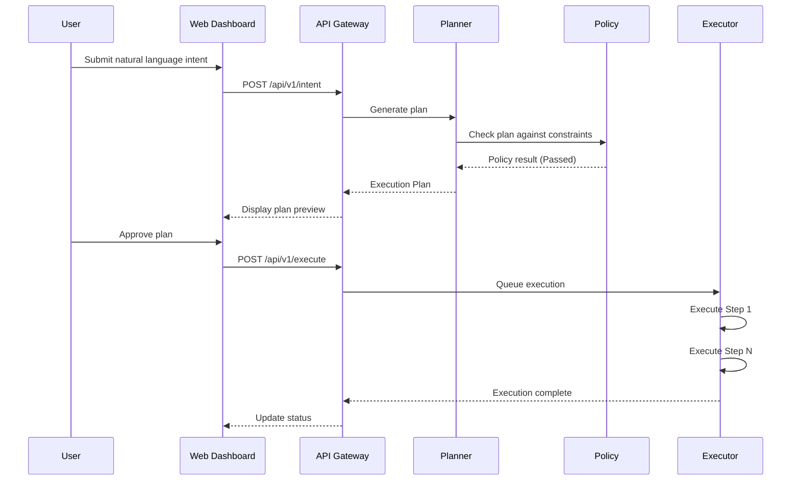

# Data Flow

Understanding the lifecycle of a request from intent to execution.

## The Intent Lifecycle

```mermaid
sequenceDiagram
    participant User
    participant Web as Web Dashboard
    participant API as API Gateway
    participant Planner
    participant Policy
    participant Executor

    User->>Web: Submit natural language intent
    Web->>API: POST /api/v1/intent
    API->>Planner: Generate plan
    Planner->>Policy: Check plan against constraints
    Policy-->>Planner: Policy result (Passed)
    Planner-->>API: Execution Plan
    API-->>Web: Display plan preview

    User->>Web: Approve plan
    Web->>API: POST /api/v1/execute
    API->>Executor: Queue execution
    Executor->>Executor: Execute Step 1
    Executor->>Executor: Execute Step N
    Executor-->>API: Execution complete
    API-->>Web: Update status
```