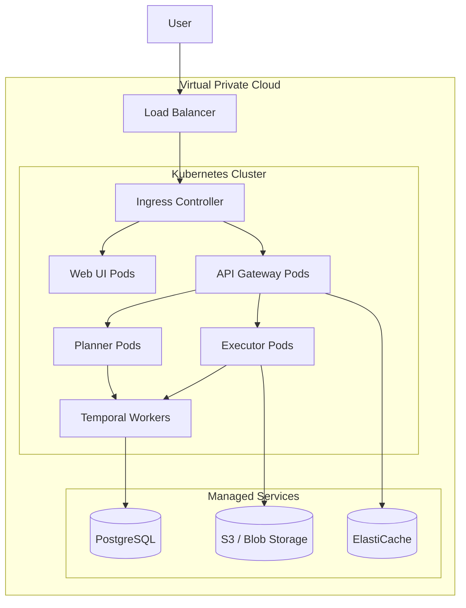

# Deployment Architecture

GovernOS supports flexible deployment models ranging from a single-node Docker setup to a highly available, multi-zone Kubernetes cluster.

## Enterprise Kubernetes Deployment

For production workloads, we recommend deploying GovernOS on a managed Kubernetes cluster (EKS, GKE, AKS).

## Scaling Considerations

- **API/Web**: Stateless, scale horizontally based on CPU/Memory or request latency.
- **Executor**: Scale based on queue depth. Compute-heavy when processing complex actions.
- **Database**: Use a connection pooler (e.g., PgBouncer). Read replicas can be used for the Web dashboard.