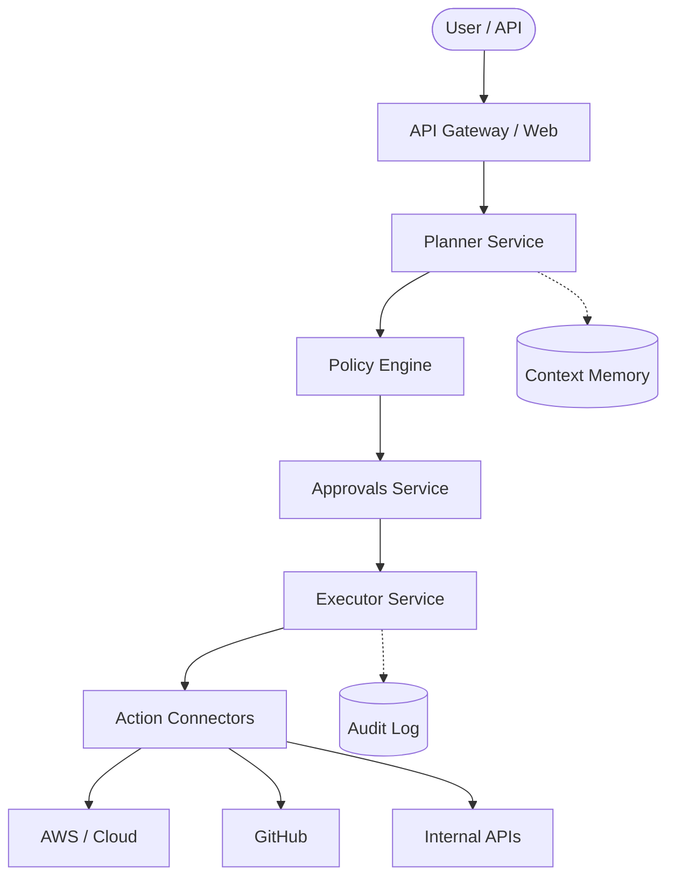

# System Architecture

GovernOS is built on a distributed, microservices-oriented architecture designed for scale, security, and extensibility.

## High-Level Architecture

The system consists of several core services that coordinate to process user intents into trusted executions.

## Core Services

### Planner Service
Translates natural language intents or YAML manifests into an actionable Execution Plan. It queries the **Memory Service** for context and scopes.

### Policy Engine
Evaluates the Execution Plan against defined constraints (e.g., spending limits, required roles).

### Approvals Service
Manages the state machine for asynchronous human-in-the-loop approvals.

### Executor Service
Responsible for the physical execution of actions via plugins. It enforces the `preview()`, `execute()`, and `compensate()` contract.

### Audit Service
An append-only log of all state transitions, policy evaluations, and executed actions.