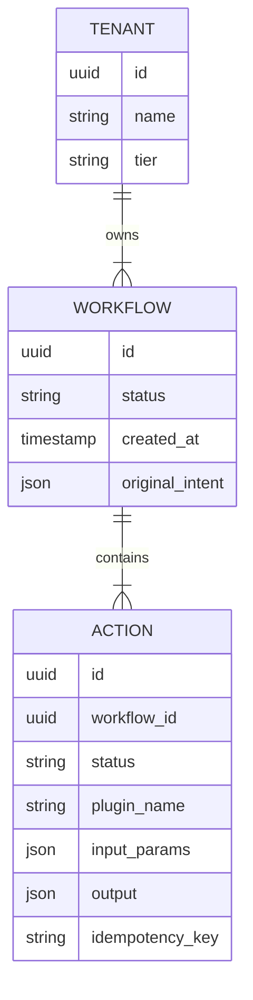

```mermaid
erDiagram
    WORKFLOW ||--|{ ACTION : contains
    WORKFLOW {
        uuid id
        string status
        timestamp created_at
        json original_intent
    }
    ACTION {
        uuid id
        uuid workflow_id
        string status
        string plugin_name
        json input_params
        json output
        string idempotency_key
    }
    TENANT ||--|{ WORKFLOW : owns
    TENANT {
        uuid id
        string name
        string tier
    }
```
