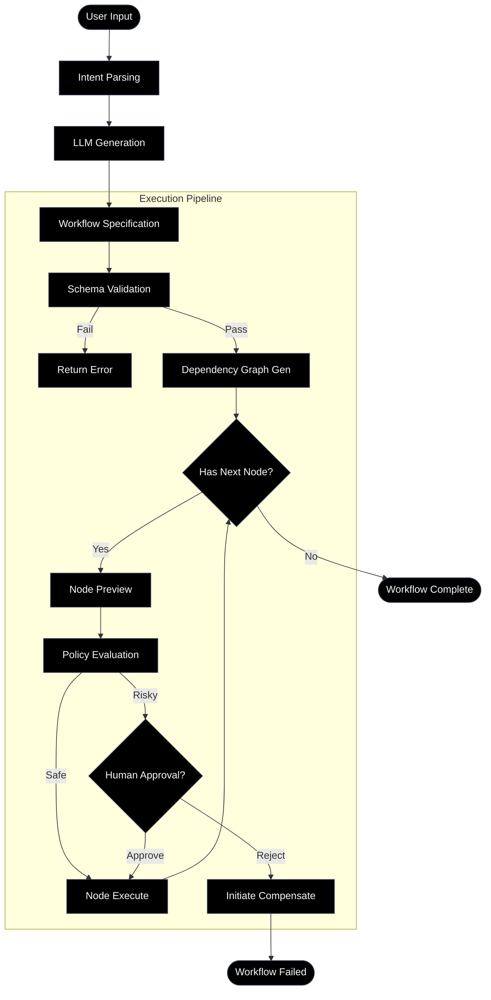

```mermaid
graph TD
    classDef default fill:#000000,stroke:#334155,stroke-width:1px,color:#f8fafc;
    classDef active fill:#1e293b,stroke:#64748b,stroke-width:2px,color:#f8fafc;
    classDef success fill:#064e3b,stroke:#10b981,stroke-width:2px,color:#f8fafc;
    classDef warning fill:#78350f,stroke:#f59e0b,stroke-width:2px,color:#f8fafc;
    classDef error fill:#7f1d1d,stroke:#ef4444,stroke-width:2px,color:#f8fafc;

    Start([User Input]) --> Parse[Intent Parsing]
    Parse --> Planner[LLM Generation]
    Planner --> Spec[Workflow Specification]

    subgraph Execution Pipeline
        Spec --> Validate[Schema Validation]
        Validate -->|Fail| HandleErr[Return Error]
        Validate -->|Pass| Graph[Dependency Graph Gen]

        Graph --> NodeIterator{Has Next Node?}
        NodeIterator -->|Yes| NodePreview[Node Preview]
        NodePreview --> Policy[Policy Evaluation]

        Policy -->|Safe| NodeExecute[Node Execute]
        Policy -->|Risky| HumanApproval{Human Approval?}

        HumanApproval -->|Reject| Rollback[Initiate Compensate]
        HumanApproval -->|Approve| NodeExecute

        NodeExecute --> NodeIterator
    end

    NodeIterator -->|No| Success([Workflow Complete])
    Rollback --> Error([Workflow Failed])
```
